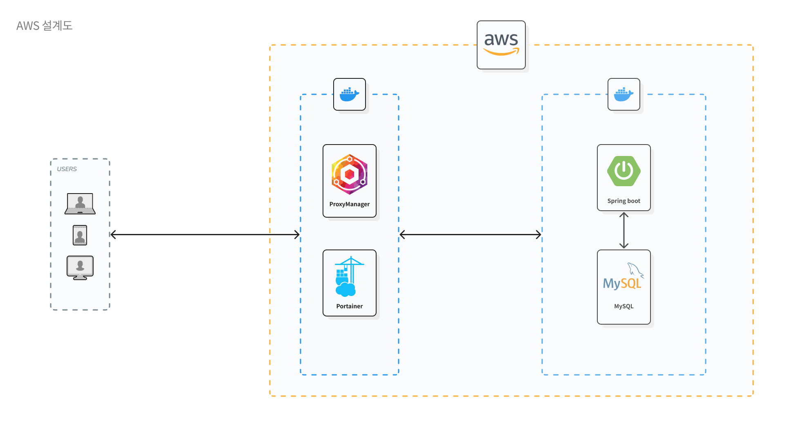
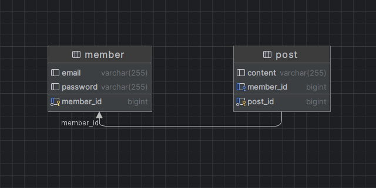
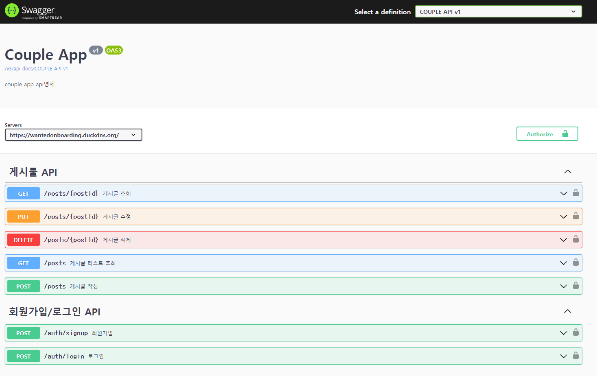

# 원티드 프리온보딩 백엔드 인턴쉽 선발 과제

### 목차

1. [지원자 정보](#1-지원자-성명--심보현)

2. [AWS 배포 주소](#2-AWS-배포-주소)

3. [애플리케이션의 실행 방법](#3-애플리케이션의-실행-방법)

4. [데이터베이스 테이블 구조](#4-데이터베이스-테이블-구조)

5. [API 명세(request/response 포함](#5-Api-명세requestresponse-포함)

6. [구현 방법 및 이유에 대한 간략한 설명](#6-구현-방법-및-이유에-대한-간략한-설명)

&nbsp;
&nbsp;

## 1. 지원자 성명 : 심보현

- 기술 스택 : Java/Springboot, MySQL

&nbsp;

## 2. AWS 배포 주소



https://wantedonboarding.duckdns.org/ (AWS 서버 - 8080 port 연결)

&nbsp;

## 3. 애플리케이션의 실행 방법

#### **로컬 환경 실행 방법**

- 실행환경 => Java 17, Springboot 3.1.2, MySQL 8.0

- JASYPT 암호화 키값을 설정 jasypt.encryptor. password=password 프로퍼티 값 추가

- application.yaml 설정값을 로컬환경에 맞춰 수정해주세요.

- ENC(암호화 값) 설정 (참고 사이트: https://www.devglan.com/online-tools/jasypt-online-encryption-decryption)
  ```yaml
  spring:
  datasource:
    url: ENC(uX1DLPFfJBKZagDjLPfQL8g+aaKjw4R7h6WAPJqLpJyrUdRtgLDDfvkRx/46KN3gYR3CImd970aSPvkmuBbiSnuSj3xgo1eac6uBTz9KTJT0U3N6NNajS75xbqV0Fl+7XvYB3Azm4XgqWcavxQcYilUwbklPb7q8eoEZvahUDgdX+HXSPoOMfND6ujhp+BU6)
    username: ENC(1/TCeEOMvacwucRrkhJQfw==)
    password: ENC(e5Q22H5HOIqpx6THA5goBQ==)
  jpa:
    database: mysql
    properties:
      hibernate.format_sql: true
      dialect: org.hibernate.dialect.MySQL5InnoDBDialect

  jasypt:
    encryptor:
      bean: jasyptEncryptorAES

  jwt:
    header: Authorization
    secret-key: ENC(XSpRq78Ndj/oX3clzShH/+f0kt9bElNi5EcbTkBqOfat/Cj8bB7qUwGe/PuzFSnXSX72NStvnafxtU5UMzjY3PSERnbvsvlU4UqDLtDMPLXR9Gqs1HAt1+L6pH1dsxpGFpFRqpa/EUx/n+SDnlg8f0C02C+OHQRRdJlEon5IFUqcjaUzBoHoqQiSJC1XQGf8)
    token-validity-in-seconds: ENC(o0tuuMJU/8L1pM2Tq/wTXA==)
  ```

  &nbsp;

#### **docker-compose.prod.yaml 실행 방법**

- **docker 환경이 반드시 세팅되어 있어야 합니다.**

- **CLI를 입력하는 위치는 docker-compose.prod.yaml 위치를 기준으로 합니다.**

&nbsp;

- git clone
  ```
  git clone https://github.com/scofe97/wanted-pre-onboarding-backend.git
  ```
- prod.env 파일 생성
  ```shell
  vim prod.env
  ```
- prod.env 파일 구성 형식

  ```
  DB_ROOT_PASSWORD=
  DB_NAME=
  DB_USER=
  DB_PASSWORD=
  WEB_PROFILE=prod
  WEB_JASYPT_PASSWORD=

  DB_URL=jdbc:mysql://prod-db:3306/onboarding?useUnicode=true&characterEncoding=UTF-8&characterSetResults=UTF-8&serverTimezone=Asia/Seoul
  DB_USERNAME=
  DB_PASSWORD=password
  DB_DRIVER=com.mysql.cj.jdbc.Driver
  ```

- Springboot gragle build 실행
  ```
  ./gradlew build -Djasypt.encryptor.password=password
  ```
- docker network 생성
  ```
  docker network create onboarding-network
  ```
- docker-compose.prod.yaml 실행
  ```
  docker-compose -f docker-compose.prod.yaml --env-file prod.env up -d
  ```

&nbsp;

## 4. 데이터베이스 테이블 구조



### Member

- 이 테이블은 애플리케이션의 사용자 정보를 저장합니다.

- id: 고유 식별자

- email: 이메일 주소, @가 포함되어야 한다.

- name: 사용자 이름

### Post

- 이 테이블은 애플리케이션의 게시글 정보를 저장합니다.

- id: 고유 식별자

- content: 게시글 내용
- member_id: 게시글 작성

&nbsp;

## 5. API 명세 / Demo 영상



https://wantedonboarding.duckdns.org/swagger-ui/index.htmll (Swagger 주소)

#### 1. **Member**

- **회원가입**

    - end point:
      ```
        POST /auth/signup
      ```
    - Request
        - Body: {
          "email": "test@" ,
          "name": "test",
          "password": "pass1234"
          }
    - Success Response
        - 201 Created => 사용자 생성
    - Error Response
        - 400 Bad Request => 요청이 잘못 or 필수 정보 누락 or 유효성 검사 탈락 or 이메일 중복

- **로그인**

    - end point:
      ```
      POST /auth/login
      ```
    - Request
        - Body: {
          "email": "test@" ,
          "password": "pass1234"
          }
    - Success Response
        - 200 Ok => 유저 성공적으로 로그인, jwt를 이용해서 생성한 token 반환
    - Error Response
        - 400 Bad Request => 요청이 잘못 or 필수 정보 누락 or 유효성 검사 탈락

  &nbsp;

#### 2. **Post**

- **게시물 작성**

    - end point:

      ```
      POST /posts
      ```

    - Request

        - Body: {"content": "게시글 내용"}
        - Headers: {
          Authorization: Bearer {token}
          }

    - Success Response

        - 201 Created: 게시글이 성공적으로 생성, 생성 게시글 반환

    - Error Response
        - 401 UnauthenticatedError => 로그인 하지 않은 유저 (로그인 해야 작성가능)
      <hr/>

- **게시글 리스트 조회**

    - end point:
      ```
      GET /posts?page=0&size=1&sort=asc
      ```
    - Success Response
        - 200 OK: 요청에 성공, 게시글 목록 반환
    - Error Response
        - 400 Bad Request: 요청이 잘못
      <hr/>

- **게시글 조회**

    - end point:
      ```
      GET /posts/{postId}
      ```
    - Success Response
        - 200 OK: 요청에 성공하고 해당 ID의 게시글을 반환
    - Error Response
        - 400 Bad Request: 요청이 잘못
        - 404 Not Found: 해당 ID의 게시글이 존재 ❌
        - 500 Internal Server Error: 서버 오류로 게시글 조회에 실패
      <hr/>

- **게시글 수정**
    - end point:
      ```
      PUT /posts/{postId}
      ```
    - Request
        - Body: {
          "content":"수정된 게시글 내용"
          }
        - Headers: {
          Authorization: Bearer {token}
          }
    - Success Response
        - 200 OK: 요청에 성공하고 게시글이 수정
    - Error Response
        - 400 Bad Request: 요청이 잘못되었거나 필수 정보가 누락
        - 403 Forbidden : UnauthorizedError 게시물 작성자가 아닐 경우 에러
        - 404 Not Found: 해당 ID의 게시글이 존재❌
      <hr/>
- **게시글 삭제**
    - end point:
      ```
      DELETE /posts/{postId}
      ```
    - Request
        - Headers: {
          Authorization: Bearer {token}
          }
    - Success Response:
        - 204 No Content: 요청에 성공하고 게시글이 삭제
    - Error Response
        - 403 Forbidden : UnauthorizedError 게시물 작성자가 아닐 경우 에러
        - 404 Not Found: 해당 ID의 게시글이 존재❌

&nbsp;

## 6. 구현 방법 및 이유에 대한 간략한 설명

- 명세서를 기준으로 삼고 최대한 부가적인 요소 없이 진행했습니다.

- **[필수기능]** JWT를 통한 로그인/회원가입 구현의 경우 Spring Security를 활용해서 Token기반의 인증을 구현했습니다.

- **[필수기능]** 게시글 CRUD의 경우 일반적인 MVC로 구현했으며, JPA Repository를 활용했습니다.

- [추가기능] 단위테스트의 경우 Mocking을 활용해서 진행했습니다.

- [추가기능] AWS 배포의 경우, docker-compose를 통한 컨테이너 배포를 진행했으며, ProxyManager를 통해 https 통신이되도록 했습니다.

&nbsp;
